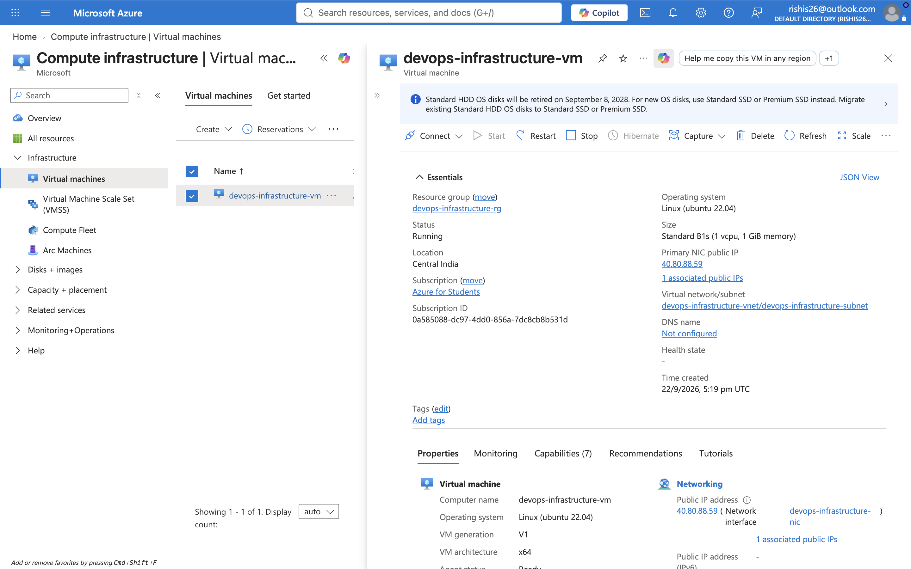
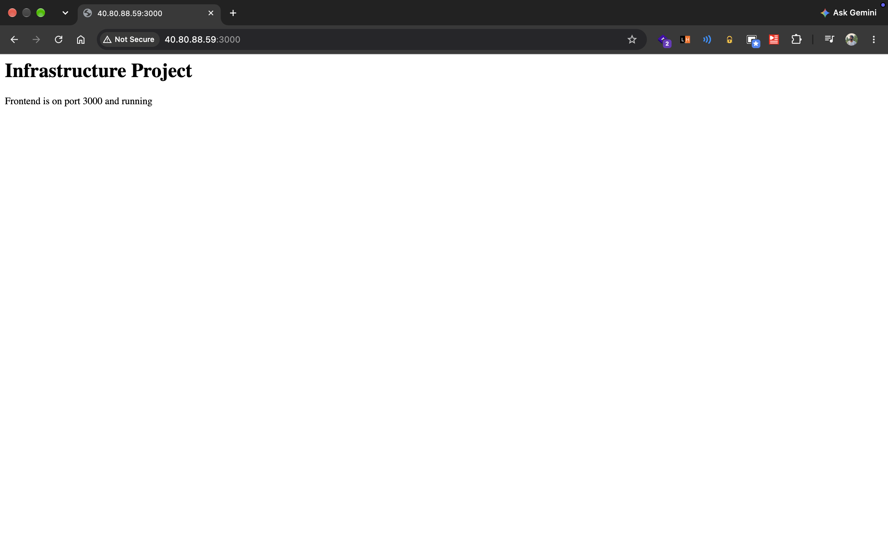
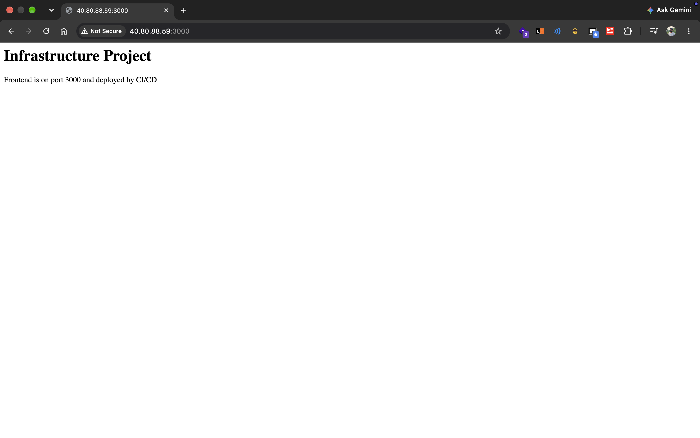
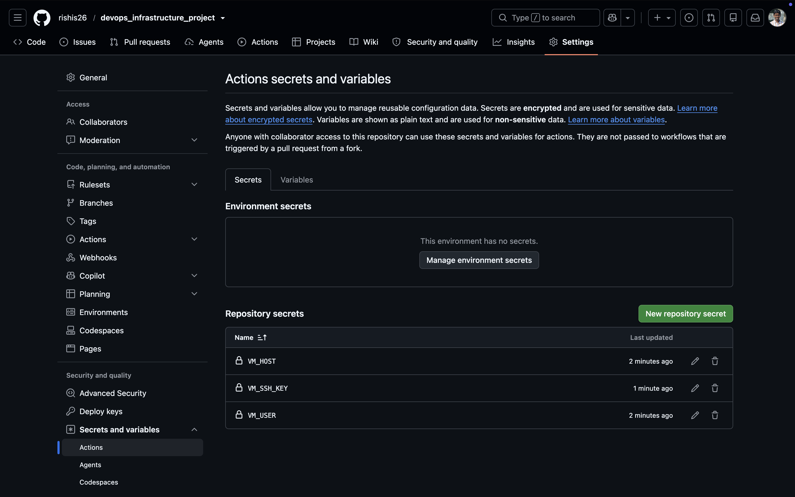
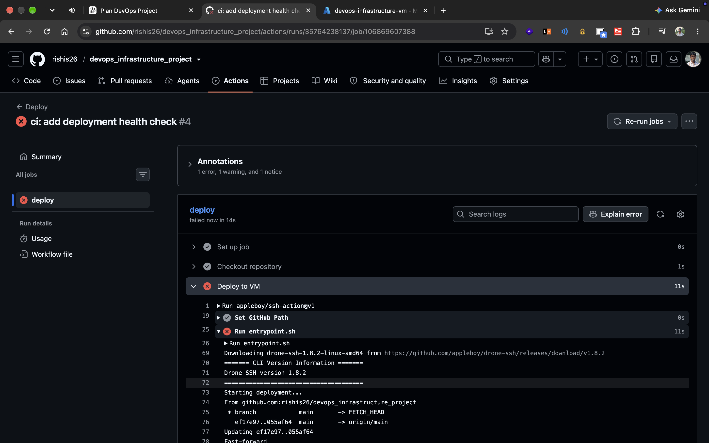
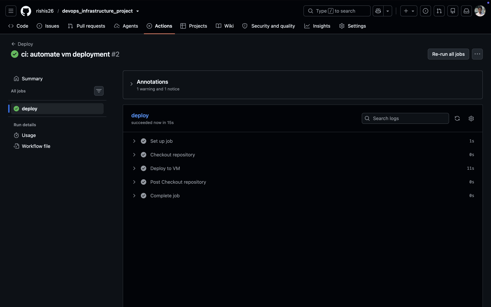
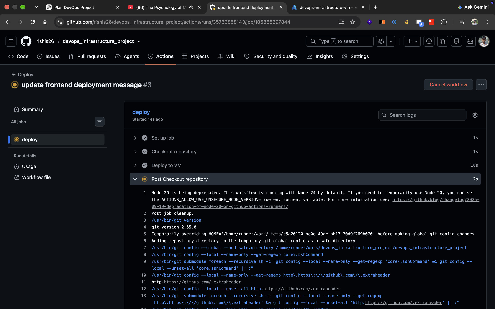

# DevOps Infrastructure Project

### Infrastructure as Code with Terraform + Azure + Docker + CI/CD


---

## About

This project was built as a hands-on **DevOps learning project**.

The application itself is intentionally simple. The main purpose was not to build a complex application, but to understand how application infrastructure can be created, configured, deployed, monitored, and automated.

The project focused on:

- Infrastructure as Code
- Terraform
- Microsoft Azure
- Linux
- SSH
- Docker
- Docker Compose
- GitHub Actions
- CI/CD
- Health checks
- Deployment debugging

The most important part of this project was learning **Terraform and Infrastructure as Code**.

---

# Main Focus: Terraform

Terraform was the central concept of this project.

Instead of manually creating every Azure resource through the Azure Portal, I defined the infrastructure in code and allowed Terraform to create and manage it.

The idea was:

```text
Terraform Configuration
        ↓
Terraform Plan
        ↓
Terraform Apply
        ↓
Azure Infrastructure
````

This made the infrastructure reproducible and allowed me to understand exactly what resources were required for the application.

---

# Why Terraform?

Before using Terraform, cloud resources can be created manually through a cloud provider's dashboard.

For example:

```text
Azure Portal
   ↓
Create Resource Group
   ↓
Create Virtual Network
   ↓
Create Subnet
   ↓
Create NSG
   ↓
Create Public IP
   ↓
Create NIC
   ↓
Create VM
```

Terraform allows the same infrastructure to be described as code.

```text
main.tf
   ↓
Terraform
   ↓
Azure
```

This is the main lesson I wanted to understand from this project:

> Infrastructure can be treated as code.

---

# Terraform Architecture

The Terraform configuration was located inside:

```text
terraform/
├── main.tf
└── .terraform.lock.hcl
```

The main configuration defined the Azure infrastructure required by the project.

The infrastructure included:

* Resource Group
* Virtual Network
* Subnet
* Network Security Group
* Network Security Rules
* Public IP
* Network Interface
* Linux Virtual Machine

---

# Terraform Provider

The Azure provider was configured in `main.tf`.

```hcl
terraform {
  required_providers {
    azurerm = {
      source  = "hashicorp/azurerm"
      version = "~> 4.0"
    }
  }
}

provider "azurerm" {
  features {}
}
```

The provider is what allows Terraform to communicate with Azure.

In simple terms:

```text
Terraform
   ↓
Azure Provider
   ↓
Microsoft Azure
```

---

# Terraform Resources

The infrastructure was created using Terraform resources.

## Resource Group

```hcl
resource "azurerm_resource_group" "main" {
  name     = "devops-infrastructure-rg"
  location = "Central India"
}
```

This created the main Azure resource group.

---

## Virtual Network

```hcl
resource "azurerm_virtual_network" "main" {
  name                = "devops-infrastructure-vnet"
  address_space       = ["10.0.0.0/16"]
  location            = azurerm_resource_group.main.location
  resource_group_name = azurerm_resource_group.main.name
}
```

The virtual network provided the private network for the infrastructure.

---

## Subnet

```hcl
resource "azurerm_subnet" "main" {
  name                 = "devops-infrastructure-subnet"
  resource_group_name  = azurerm_resource_group.main.name
  virtual_network_name = azurerm_virtual_network.main.name
  address_prefixes     = ["10.0.1.0/24"]
}
```

The subnet was created inside the virtual network.

---

# Network Security Group

The project also created an Azure Network Security Group.

The NSG controlled which inbound ports could reach the VM.

The project allowed:

| Port   | Purpose  |
| ------ | -------- |
| `22`   | SSH      |
| `3000` | Frontend |

The backend ran on port `8080`, but it was not publicly exposed through the Azure NSG.

This helped me understand an important difference:

```text
Docker port publishing
        ≠
Azure network access
```

Docker can expose a port on the VM while Azure's network security rules can still prevent external access.

---

# Public IP

Terraform also created the public IP:

```hcl
resource "azurerm_public_ip" "main" {
  name              = "devops-infrastructure-ip"
  location          = azurerm_resource_group.main.location
  resource_group_name = azurerm_resource_group.main.name
  allocation_method = "Static"
  sku               = "Standard"
}
```

This allowed the VM to be accessed from the internet.

---

# Network Interface

The VM required a network interface connected to the subnet and public IP.

Terraform handled this as well.

```text
Internet
   ↓
Public IP
   ↓
Network Interface
   ↓
Subnet
   ↓
Virtual Network
   ↓
VM
```

---

# Azure Virtual Machine

Finally, Terraform created the Linux VM.

The VM used:

```text
Ubuntu 22.04
Standard_B1s
Central India
```

The VM was configured with the project-specific SSH public key.

The private SSH key remained on my local machine.

---

## Azure Infrastructure Created Through Terraform



---

# Terraform Workflow

The Terraform workflow I learned was:

```text
Write Configuration
        ↓
terraform fmt
        ↓
terraform init
        ↓
terraform validate
        ↓
terraform plan
        ↓
terraform apply
```

Each command has a different purpose.

---

## `terraform fmt`

Formats Terraform files into the standard Terraform style.

```bash
terraform fmt
```

---

## `terraform init`

Initializes the Terraform project and downloads the required provider.

```bash
terraform init
```

---

## `terraform validate`

Checks whether the Terraform configuration is syntactically and structurally valid.

```bash
terraform validate
```

---

## `terraform plan`

Shows what Terraform intends to change.

```bash
terraform plan
```

This was one of the important Terraform concepts I learned.

Terraform does not immediately change infrastructure when running `plan`.

It first shows the proposed changes.

---

## `terraform apply`

Actually creates or changes the infrastructure.

```bash
terraform apply
```

---

# Terraform State

Terraform keeps track of infrastructure using its state.

The state contains information about resources Terraform manages.

For example:

```text
Terraform
    ↓
State
    ↓
Azure Resources
```

The state files were intentionally ignored from Git:

```gitignore
terraform/.terraform/
terraform/*.tfstate
terraform/*.tfstate.*
```

The provider lock file was kept in the repository.

---

# Docker

After creating the infrastructure, the next part was running the application using Docker.

There were two simple services:

```text
Frontend
   ↓
Port 3000

Backend
   ↓
Port 8080
```

Both services had their own Dockerfile.

---

# Backend Dockerfile

```dockerfile
FROM node:22-alpine

WORKDIR /app

COPY package*.json ./

RUN npm install

COPY . .

EXPOSE 8080

CMD ["npm", "start"]
```

The backend exposed port `8080`.

---

# Frontend Dockerfile

```dockerfile
FROM node:22-alpine

WORKDIR /app

COPY package*.json ./

RUN npm install

COPY . .

EXPOSE 3000

CMD ["npm", "start"]
```

The frontend exposed port `3000`.

---

# Docker Compose

Instead of starting both containers manually, Docker Compose was used.

```yaml
services:
  backend:
    build: ./backend
    container_name: infrastructure-backend
    ports:
      - "8080:8080"

  frontend:
    build: ./frontend
    container_name: infrastructure-frontend
    ports:
      - "3000:3000"
```

This allowed both services to be started together.

```bash
docker compose up -d --build
```

---

## Application Deployment





---

# Linux and SSH

The Azure VM was running Ubuntu Linux.

I connected to the VM using SSH:

```bash
ssh -i ~/.ssh/devops-infrastructure-project azureuser@<VM_PUBLIC_IP>
```

A dedicated SSH key was created specifically for this project.

The private key was never committed to GitHub.

---

# Deployment Script

The deployment process was placed into `deploy.sh`.

```bash
#!/bin/bash

set -e

echo "Starting deployment..."

git pull origin main

docker compose up -d --build

echo "Deployment completed successfully."
```

This made the deployment process repeatable.

Instead of manually typing every command:

```text
git pull
docker compose build
docker compose up
```

the VM could simply run:

```bash
./deploy.sh
```

---

# GitHub Actions

GitHub Actions was used to automate deployment.

The basic flow was:

```text
Git Push
   ↓
GitHub Actions
   ↓
SSH
   ↓
Azure VM
   ↓
deploy.sh
   ↓
Docker Compose
   ↓
Application
```

---

# CI/CD Workflow

The workflow was triggered by pushes to the `main` branch.

The deployment process used:

* GitHub Actions
* SSH
* Azure VM
* Docker Compose
* Deployment script
* Backend health check

The workflow connected to the VM and executed:

```bash
cd ~/devops_infrastructure_project
./deploy.sh
```

---

# GitHub Actions Secrets

Sensitive connection information was stored as GitHub Actions secrets instead of being written directly into the workflow.

The secrets used were:

```text
VM_HOST
VM_USER
VM_SSH_KEY
```

The private SSH key was stored as a GitHub secret and was never committed to the repository.



---

# The First CI/CD Failure

The first health check did not succeed.

The initial workflow attempted to check the backend using HTTPS:

```text
https://localhost:8080/health
```

But the backend was a normal HTTP Express server.

The correct endpoint was:

```text
http://localhost:8080/health
```

This resulted in the first failed GitHub Actions deployment.



---

# Debugging the Failure

The failure helped identify two separate things.

## 1. HTTP vs HTTPS

The backend was running using HTTP.

So:

```text
Wrong:
https://localhost:8080/health

Correct:
http://localhost:8080/health
```

The workflow was changed accordingly.

---

## 2. Application Readiness

After fixing HTTP, there was another issue.

The container could still be starting when GitHub Actions immediately performed the health check.

This meant that even though the application was going to work, the check could happen too early.

The solution was to add retry logic.

---

# Adding Retry Logic

The workflow was changed to retry the health check several times.

The basic idea was:

```text
Check backend
    ↓
Is it healthy?
    ↓
YES → Success
    ↓
NO
    ↓
Wait
    ↓
Try again
```

The final workflow checked the backend multiple times before declaring the deployment failed.

This made the deployment more reliable.

---

# From Red to Green

The final deployment successfully:

```text
Git Push
   ↓
GitHub Actions
   ↓
SSH into VM
   ↓
git pull
   ↓
docker compose up -d --build
   ↓
Backend health check
   ↓
HTTP 200
   ↓
Deployment successful
```





---

# Other Small Mistakes and Fixes

This project was intentionally documented as a learning process.

Not everything worked on the first attempt.

Some of the issues encountered included:

### Dockerfile syntax

There were small Dockerfile configuration mistakes during development that had to be corrected before the containers could build successfully.

### Azure networking

Understanding the difference between:

```text
Docker port publishing
```

and:

```text
Azure NSG rules
```

was another important part of the project.

### Health check protocol

The first health check used HTTPS instead of HTTP.

### Application readiness

The backend was sometimes not ready immediately when the workflow performed the first health check.

The retry mechanism solved this.

These failures were useful because they showed how deployment problems are actually diagnosed instead of only seeing the final successful result.

---

# Monitoring the VM

While the VM was running, basic Linux and Docker monitoring commands were used.

## Memory

```bash
free -h
```

## Disk

```bash
df -h
```

## System uptime and load

```bash
uptime
```

## Docker resource usage

```bash
docker stats --no-stream
```

The VM had approximately:

```text
Memory: ~897 MB
Disk: ~29 GB
```

The two application containers used only a small amount of memory.

---

# Project Structure

```text
devops_infrastructure_project/
│
├── .gitignore
├── README.md
│
├── backend/
│   ├── Dockerfile
│   ├── package.json
│   └── server.js
│
├── frontend/
│   ├── Dockerfile
│   ├── package.json
│   └── server.js
│
├── deploy.sh
├── docker-compose.yml
│
├── terraform/
│   ├── main.tf
│   └── .terraform.lock.hcl
│
└── docs/
    └── images/
        ├── azure_vm.png
        ├── deployment-1.png
        ├── deployment.png
        ├── error.png
        ├── github_action-1.png
        ├── github_action.png
        └── secret_screen.png
```

---

# Technologies

| Technology      | Purpose                       |
| --------------- | ----------------------------- |
| Terraform       | Infrastructure as Code        |
| Microsoft Azure | Cloud infrastructure          |
| Ubuntu          | Server operating system       |
| SSH             | Remote server access          |
| Docker          | Containerization              |
| Docker Compose  | Multi-container application   |
| Node.js         | Application runtime           |
| Express.js      | Backend and frontend services |
| Git             | Version control               |
| GitHub          | Source code hosting           |
| GitHub Actions  | CI/CD automation              |
| Bash            | Deployment automation         |

---

# What I Actually Learned

## Terraform

The biggest learning from this project was understanding Infrastructure as Code.

I learned:

* What Terraform is
* What a Terraform provider does
* What Terraform resources are
* How Terraform creates Azure infrastructure
* `terraform init`
* `terraform fmt`
* `terraform validate`
* `terraform plan`
* `terraform apply`
* Terraform state
* Resource dependencies
* Azure networking through Terraform
* Creating a VM through Terraform

---

## Cloud

I learned how the different Azure resources connect together.

```text
Resource Group
      ↓
Virtual Network
      ↓
Subnet
      ↓
Network Interface
      ↓
Public IP
      ↓
Virtual Machine
```

I also learned the role of Network Security Groups in controlling network access.

---

## Docker

I learned:

* How Dockerfiles work
* How Docker builds images
* How containers run applications
* Port mapping
* Docker Compose
* Running multiple services together
* Basic container monitoring

---

## Linux

I learned basic server operations:

* SSH
* Installing packages
* Running Docker on Ubuntu
* Checking system resources
* Checking running containers
* Running deployment scripts

---

## CI/CD

I learned how a simple deployment pipeline works:

```text
Code Change
    ↓
Git Push
    ↓
GitHub Actions
    ↓
SSH
    ↓
Server
    ↓
Docker Compose
    ↓
Health Check
```

More importantly, I learned that CI/CD is not always successful on the first attempt.

Debugging the failed health check and then making the workflow reliable was part of the learning.

---

# Final Architecture

```text
                     GitHub
                        │
                        │ git push
                        ▼
               GitHub Actions
                        │
                        │ SSH
                        ▼
                Azure Linux VM
                        │
                 deploy.sh
                        │
                        ▼
              Docker Compose
                 /          \
                /            \
               ▼              ▼
        Frontend            Backend
        Port 3000           Port 8080
                              │
                              ▼
                         /health
```

Terraform managed the infrastructure underneath:

```text
                    Terraform
                        │
                        ▼
                 Microsoft Azure
                        │
        ┌───────────────┼────────────────┐
        ▼               ▼                ▼
   Resource Group    Networking          VM
                        │
                 ┌──────┴──────┐
                 ▼             ▼
               VNet           NSG
                 │
               Subnet
                 │
                NIC
                 │
             Public IP
```

---

# Project Status

The project was created as a hands-on DevOps learning environment.

The Azure VM was intentionally deleted after the deployment and CI/CD work was completed.

The source code, Terraform configuration, Git history, GitHub Actions workflow, documentation, and screenshots remain in the repository as a record of the learning process.

The project does not currently run on a live Azure VM.

---

# Key Takeaway

The main lesson from this project was not the application itself.

It was understanding how infrastructure and deployment fit together:

```text
Terraform
   ↓
Infrastructure
   ↓
Azure
   ↓
Linux VM
   ↓
Docker
   ↓
Application
   ↓
GitHub Actions
   ↓
Automated Deployment
   ↓
Health Check
```

Terraform was the most important new concept in this project because it changed the way I thought about cloud infrastructure:

> Instead of manually creating infrastructure, infrastructure can be defined, reviewed, and created using code.

---